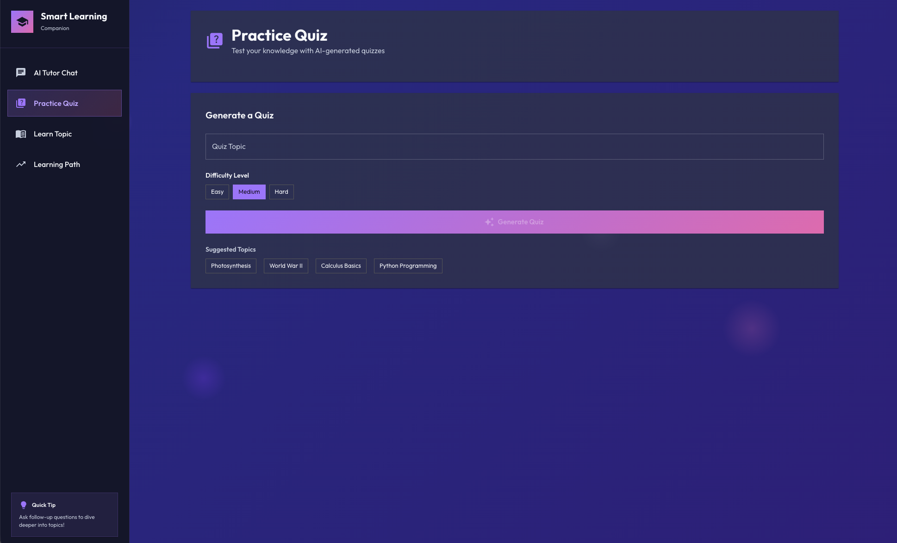

# 🎓 Smart Learning Companion

An intelligent, AI-powered educational assistant built with **Jac-Client** and **ByLLM** that makes learning engaging, interactive, and personalized. Whether you're a student, professional, or lifelong learner, this companion helps you master any topic through conversations, quizzes, and customized learning paths.


## 📸 Screenshots

### AI Tutor Chat Interface

*Interactive chat interface where you can ask questions and get intelligent responses from your AI tutor*

### Practice Quiz

*Generate and take AI-powered quizzes on any topic with multiple difficulty levels*

## ✨ Features

### 💬 AI Chat Tutor
- **Interactive Conversations**: Ask questions about any topic and get clear, detailed explanations
- **Context-Aware**: Maintains conversation history for coherent, continuous learning
- **Friendly & Patient**: Designed to encourage learning with supportive responses
- **Multi-Topic Support**: Switch between subjects seamlessly

### 📚 Topic Learning
- **Adaptive Explanations**: Choose your learning level (Beginner, Intermediate, Advanced)
- **Structured Content**: Get organized explanations with Overview, Key Concepts, Examples, and Summary
- **Real-World Analogies**: Complex concepts explained through relatable examples
- **Any Subject**: From quantum physics to ancient history to machine learning

### 🎯 Interactive Quizzes
- **AI-Generated Questions**: Create custom quizzes on any topic instantly
- **Multiple Choice Format**: Test your knowledge with 4-option questions
- **Instant Feedback**: See correct answers and your score immediately
- **Performance Tracking**: Get percentage scores and motivational feedback
- **Retry Option**: Keep practicing until you master the topic

### 🗺️ Personalized Learning Paths
- **Goal-Oriented**: Define what you want to learn or achieve
- **Step-by-Step Roadmap**: Get 5-8 structured steps to reach your goal
- **Time Estimates**: Know how long each learning phase will take
- **Expert Tips**: Receive practical advice for successful learning
- **Resource Recommendations**: Get curated learning resources

## 🚀 Getting Started

### Prerequisites

- **Python 3.12+** installed
- **Node.js 16+** and npm
- **Jaclang** framework
- **Jac-Client** library
- **ByLLM** library
- **OpenAI API key** (for GPT-4o)

### Installation

1. **Clone the repository**
   ```bash
   git clone https://github.com/jaseci-labs/Agentic-AI.git
   cd Agentic-AI/smart-learning-companion
   ```

2. **Set up your API key**
   
   Create a .env file or set environment variable:
   ```bash
   export OPENAI_API_KEY='your-api-key-here'
   ```

3. **Install dependencies**
   
   simply run:
   ```bash
   npm install
   ```
   or else,
   
   If you want to Install all required npm packages manually:
   ```bash
   npm install react@19.2.0 react-dom@19.2.0
   npm install @mui/material@7.3.5 @mui/icons-material@7.3.5 @mui/lab@7.0.1-beta.19
   npm install @emotion/react@11.14.0 @emotion/styled@11.14.1
   npm install react-router-dom@6.30.1
   npm install framer-motion@12.23.24
   npm install -D vite@6.4.1 @babel/cli@7.28.3 @babel/core@7.28.5 @babel/preset-env@7.28.5 @babel/preset-react@7.28.5
   ```
   

4. **Start the application**
   ```bash
   jac serve app.jac
   ```

5. **Open your browser**
   
   Navigate to http://localhost:8000 (or the port shown in terminal)

## 🎨 Technology Stack

- **Frontend**: Jac-Client (React-based)
- **Backend**: Jaclang Walkers
- **AI Engine**: ByLLM with GPT-4o
- **Styling**: Modern CSS with gradients and animations
- **State Management**: React Hooks (useState)

## 📖 How to Use

### Chat Tutor Mode
1. Click the **💬 Chat Tutor** tab
2. Type your question in the input field
3. Press Enter or click Send
4. Receive intelligent, contextual responses
5. Continue the conversation naturally

### Learn a Topic
1. Click the **📚 Learn Topic** tab
2. Enter any subject you want to learn
3. Select your learning level (Beginner/Intermediate/Advanced)
4. Click **Learn 🚀**
5. Read through the structured explanation

### Take a Quiz
1. Click the **🎯 Quiz Me** tab
2. Enter a topic for the quiz
3. Click **Generate Quiz 🎲**
4. Answer all 5 questions by clicking options
5. Submit to see your score and correct answers
6. Retry with a new quiz to improve

### Create a Learning Path
1. Click the **🗺️ Learning Path** tab
2. Enter your learning goal (e.g., "Become a data scientist")
3. Click **Create Path 🚀**
4. Follow the step-by-step roadmap
5. Use the tips and resources provided

## 🧠 AI Walkers

### learn_topic
Explains any topic with adjustable complexity levels using reasoning-enhanced LLM calls.

### generate_quiz
Creates multiple-choice quizzes with Chain of Thought prompting for accurate question generation.

### chat_tutor
Provides conversational tutoring with context awareness and encouraging responses.

### suggest_learning_path
Designs personalized learning roadmaps with structured steps, tips, and resources.

## 🎯 Use Cases

- **Students**: Get homework help and exam preparation
- **Professionals**: Learn new skills for career advancement
- **Educators**: Create teaching materials and assessments
- **Curious Minds**: Explore any topic that interests you
- **Self-Learners**: Follow structured paths for systematic learning

## 🌟 Key Highlights

- ✅ **Beautiful Modern UI** with gradient backgrounds and smooth animations
- ✅ **Fully Responsive** design works on desktop, tablet, and mobile
- ✅ **Real-time AI Responses** with loading indicators
- ✅ **Context-Aware Conversations** that remember your discussion
- ✅ **Adaptive Learning** that matches your skill level
- ✅ **Interactive Quizzes** with instant feedback
- ✅ **Goal-Oriented Planning** with actionable steps

## 🛠️ Project Structure

```
smart-learning-companion/
├── app.jac              # Main application (backend walkers + frontend)
├── app.cl.jac          # Client-side imports (CSS)
├── styles.css          # Modern CSS styling
├── package.json        # Node dependencies
├── vite.config.js     # Vite configuration
├── README.md          # This file
├── build/             # Compiled production files
└── src/               # Source files
```

## 🤝 Contributing

Contributions are welcome! Feel free to:
- Report bugs
- Suggest new features
- Improve documentation
- Submit pull requests

## 📝 License

This project is part of the Jaseci Agentic-AI repository and follows its licensing terms.

## 🙏 Acknowledgments

- Built with [Jaclang](https://docs.jaseci.org/)
- Powered by [ByLLM](https://github.com/jaseci-labs/jaseci)
- AI by [OpenAI GPT-4o](https://openai.com/)

## 📧 Support

For questions or issues:
- Open an issue in the repository
- Check the [Jaclang documentation](https://docs.jaseci.org)
- Join the Jaseci community

---

**Made with ❤️ using Jaclang, Jac-client and ByLLM**

*Start your learning journey today!* 🚀
